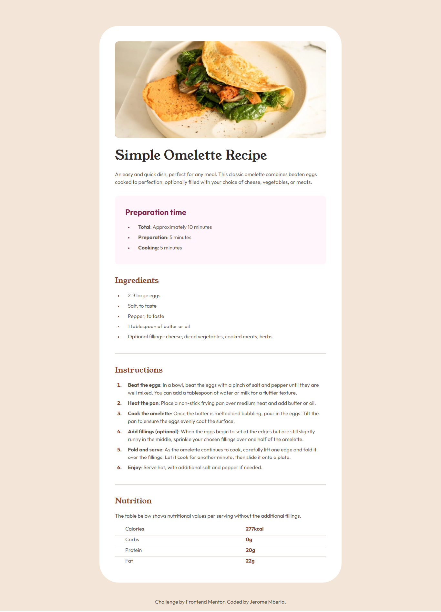

# Frontend Mentor - Recipe page solution

This is a solution to the [Recipe page challenge on Frontend Mentor](https://www.frontendmentor.io/challenges/recipe-page-KiTsR8QQKm).

## Table of contents

- [Frontend Mentor - Recipe page solution](#frontend-mentor---recipe-page-solution)
  - [Table of contents](#table-of-contents)
  - [Overview](#overview)
    - [The challenge](#the-challenge)
    - [Screenshot](#screenshot)
    - [Links](#links)
  - [Style Guide](#style-guide)
    - [Layout](#layout)
    - [Colors](#colors)
    - [Typography](#typography)
  - [My process](#my-process)
    - [Built with](#built-with)
    - [What I learned](#what-i-learned)
      - [1. Responsive Image Handling](#1-responsive-image-handling)
      - [2. CSS Custom Properties](#2-css-custom-properties)
      - [2. Accessibility Improvements](#2-accessibility-improvements)
      - [3. Responsive Layout Techniques](#3-responsive-layout-techniques)
  - [Author](#author)

## Overview

### The challenge

The challenge was to build a responsive recipe page that:

- Displays an omelette recipe with preparation time, ingredients, instructions, and nutrition information
- Matches the design provided in the preview images
- Works well on both mobile and desktop screens

### Screenshot



### Links

- Solution URL: [Frontend Mentor Solution](https://www.frontendmentor.io/solutions/responsive-recipe-page-using-html-and-css-with-accessibility-features-xyz)
- Live Site URL: [GitHub Pages](https://yourusername.github.io/recipe-page/)

## Style Guide

The design follows these style specifications:

### Layout

- Mobile: 375px
- Desktop: 1440px

### Colors

| Color             | HSL Values               | Usage                          |
|-------------------|--------------------------|--------------------------------|
| White             | hsl(0, 0%, 100%)         | Background                     |
| Stone 100         | hsl(30, 54%, 90%)        | Body background                |
| Stone 150         | hsl(30, 18%, 87%)        | Dividers, table borders        |
| Stone 600         | hsl(30, 10%, 34%)        | Body text                      |
| Stone 900         | hsl(24, 5%, 18%)         | Headings                       |
| Brown 800         | hsl(14, 45%, 36%)        | Section headings, accents      |
| Rose 800          | hsl(332, 51%, 32%)       | Preparation time heading       |
| Rose 50           | hsl(330, 100%, 98%)      | Preparation time background    |

### Typography

- **Body Copy**: 16px
- **Font Families**:
  - Primary: [Outfit](https://fonts.google.com/specimen/Outfit) (Weights: 400, 600, 700)
  - Headings: [Young Serif](https://fonts.google.com/specimen/Young+Serif) (Weight: 400)

## My process

### Built with

- Semantic HTML5 markup
- CSS custom properties
- Flexbox
- Mobile-first workflow
- Responsive design
- Accessibility best practices (ARIA roles, proper heading structure)

### What I learned

While working on this project, I learned several valuable techniques:

#### 1. Responsive Image Handling

```html
<picture>
  <source type="image/webp" srcset=".\assets\images\image-omelette.webp">
  <source type="image/jpeg" srcset=".\assets\images\image-omelette.jpeg">
  
</picture>
```

#### 2. CSS Custom Properties

```css
:root {
    --white: hsl(0, 0%, 100%);
    --stone-100: hsl(30, 54%, 90%);
    --brown-800: hsl(14, 45%, 36%);
}
```

#### 2. Accessibility Improvements

```html
<section role="region" aria-labelledby="ingredients">
      <h2 id="ingredients">Ingredients</h2>
      <ul>
        <li>2-3 large eggs</li>
        <li>Salt, to taste</li>
        <li>Pepper, to taste</li>
        <li>1 tablespoon of butter or oil</li>
        <li>Optional fillings: cheese, diced vegetables, cooked meats, herbs</li>
      </ul>
    </section>
```

#### 3. Responsive Layout Techniques

```css
@media (min-width:376px) {
    main {
        max-width: 750px;
        margin-top: 5rem;
        border-radius: calc(12px + 3rem);
    }
}
```

## Author

Name - Jerome Mberia
Frontend Mentor - @JeromeMberia
